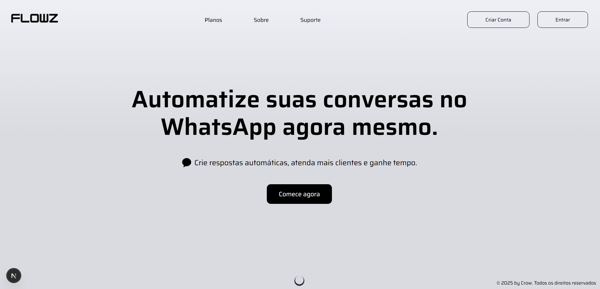

# Flowz 🚀

> Plataforma para empreendedores e usuários criarem contas, assinarem planos, gerenciar e criar mensagens automáticas, receber mensagens e acompanharem seus dados em tempo real.

O **Flowz** é um projeto em desenvolvimento feito com **Next.js 15 (App Router)** que visa oferecer uma solução completa para automação e gerenciamento de mensagens, facilitando a comunicação e o acompanhamento dos resultados.

Este projeto está sendo desenvolvido para consolidar meus conhecimentos em **full stack moderno**, utilizando autenticação, planos de assinatura, mensagens automáticas, e integração total entre frontend e backend com tecnologias atuais.

---

## 🚀 Tecnologias

* **Next.js 15 (App Router + Server Actions)**
* **TypeScript**
* **MongoDB + Mongoose**
* **NextAuth.js (autenticação)**

---

## 💻 O que estou aprendendo e construindo

### 🧠 Backend com Next.js e MongoDB

* **Criação de rotas server-side com App Router**, aproveitando as novidades do Next.js 15 para APIs e Server Actions.
* **Modelagem eficiente do banco de dados com MongoDB e Mongoose** para armazenar usuários, planos, mensagens e dados relacionados.
* **Implementação de autenticação segura** com NextAuth para controle de acesso e gerenciamento de sessões.
* **Gerenciamento de assinaturas e planos** para usuários, incluindo lógica de pagamento (em desenvolvimento).
* **Manipulação completa de mensagens automáticas**, com envio, recebimento e histórico armazenados no banco (em desenvolvimento).
* **Organização de código modular e escalável**, separando autenticação, models, conexões, e serviços.

### 🎯 Frontend com Next.js

* **Construção de interface moderna e responsiva** para fácil navegação e uso dos recursos.
* **Utilização do App Router com layouts dinâmicos e loading states** para uma melhor experiência do usuário.
* **Formulários controlados via Server Actions** para cadastro, login, criação e edição das mensagens automáticas.
* **Integração em tempo real com backend**, possibilitando atualização e monitoramento dos dados do usuário.

---

## 📲 Funcionalidades (em desenvolvimento)

* Cadastro e login de usuários com autenticação segura.
* Assinatura de planos para acesso a recursos exclusivos.
* Criação, edição e gerenciamento de mensagens automáticas enviadas pelo bot.
* Recebimento e armazenamento de mensagens automáticas.
* Dashboard para visualização de dados, histórico e performance.
* Interface intuitiva e otimizada para desktop e mobile.

---

## 📝 Observações

O **Flowz** ainda está em desenvolvimento, mas já representa um avanço importante na minha jornada como desenvolvedor full stack. A aplicação explora os recursos mais recentes do **Next.js 15**, unindo backend e frontend em um único projeto moderno, com foco em escalabilidade, segurança e experiência do usuário.

---

## 📨 Contato

📧 [guilhermemillerblack@gmail.com](mailto:guilhermemillerblack@gmail.com)

